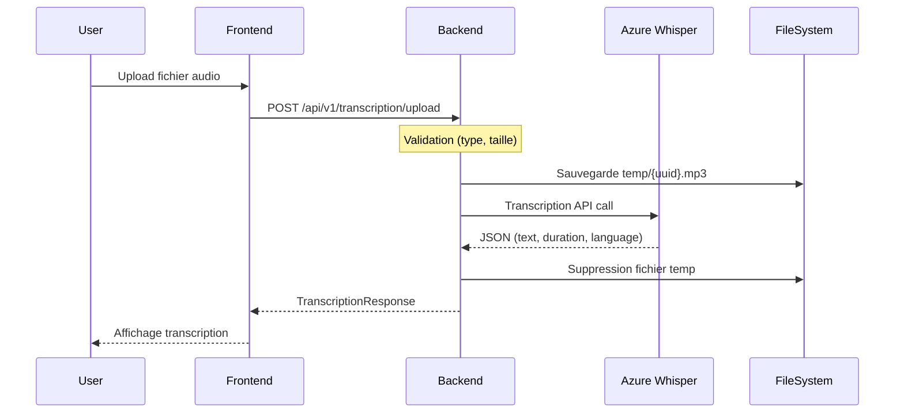
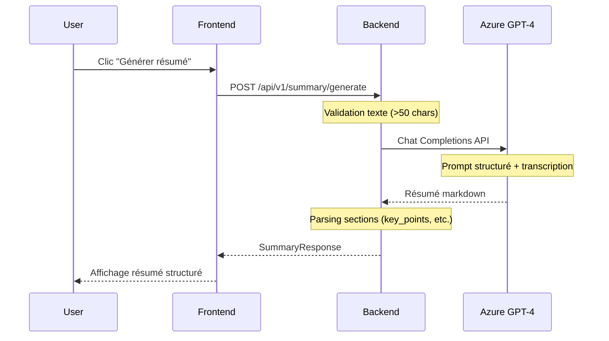

# 🏗️ Architecture Détaillée - Whispen

## Vue d'Ensemble

Whispen est une application **full-stack moderne** composée de :
- **Backend FastAPI** (Python 3.11+) : API RESTful
- **Frontend React** (Vite) : Interface utilisateur
- **Azure OpenAI** : Services IA (Whisper + GPT-4)

---

## 🎨 Architecture Globale

```
┌─────────────────────────────────────────────────────────────┐
│                      UTILISATEUR                             │
│                    (Navigateur Web)                          │
└────────────────────┬────────────────────────────────────────┘
                     │ HTTPS
                     ▼
┌─────────────────────────────────────────────────────────────┐
│                    FRONTEND REACT                            │
│  ┌──────────────────────────────────────────────────────┐   │
│  │  Components:                                          │   │
│  │  - AudioUploader.jsx (Upload + Enregistrement)       │   │
│  │  - TranscriptionResult.jsx (Affichage résultats)     │   │
│  │                                                       │   │
│  │  Services:                                            │   │
│  │  - api.js (Client HTTP Axios)                        │   │
│  └──────────────────────────────────────────────────────┘   │
└────────────────────┬────────────────────────────────────────┘
                     │ REST API (JSON)
                     ▼
┌─────────────────────────────────────────────────────────────┐
│                   BACKEND FASTAPI                            │
│  ┌──────────────────────────────────────────────────────┐   │
│  │  Routes:                                              │   │
│  │  - /api/v1/transcription/upload                      │   │
│  │  - /api/v1/summary/generate                          │   │
│  │  - /health                                            │   │
│  └──────────────────┬───────────────────────────────────┘   │
│                     │                                         │
│  ┌──────────────────▼───────────────────────────────────┐   │
│  │  Services:                                            │   │
│  │  - azure_service.py (Logique IA)                     │   │
│  │  - file_handler.py (Gestion fichiers)                │   │
│  └──────────────────┬───────────────────────────────────┘   │
│                     │                                         │
│  ┌──────────────────▼───────────────────────────────────┐   │
│  │  Utils & Models:                                      │   │
│  │  - schemas.py (Validation Pydantic)                  │   │
│  │  - config.py (Variables d'env)                       │   │
│  └──────────────────────────────────────────────────────┘   │
└────────────────────┬────────────────────────────────────────┘
                     │ Azure OpenAI API
                     ▼
┌─────────────────────────────────────────────────────────────┐
│                  AZURE OPENAI SERVICES                       │
│  ┌──────────────────────────────────────────────────────┐   │
│  │  Whisper (transcription)                             │   │
│  │  - Modèle: whisper                                   │   │
│  │  - Endpoint: /audio/transcriptions                   │   │
│  └──────────────────────────────────────────────────────┘   │
│  ┌──────────────────────────────────────────────────────┐   │
│  │  GPT-4 (summarization)                               │   │
│  │  - Modèle: gpt-4                                     │   │
│  │  - Endpoint: /chat/completions                       │   │
│  └──────────────────────────────────────────────────────┘   │
└─────────────────────────────────────────────────────────────┘
                     │
                     ▼
┌─────────────────────────────────────────────────────────────┐
│              STOCKAGE TEMPORAIRE (temp/)                     │
│  - Fichiers audio uploadés (suppression auto 24h)           │
│  - Pas de base de données (RGPD compliant)                  │
└─────────────────────────────────────────────────────────────┘
```

---

## 📦 Structure des Modules

### Backend (`backend/`)

```
backend/
├── app/
│   ├── main.py                 # Point d'entrée FastAPI
│   │   ├── Création app FastAPI
│   │   ├── Configuration CORS
│   │   ├── Middleware logging
│   │   ├── Inclusion routes
│   │   └── Gestion erreurs globales
│   │
│   ├── config.py               # Configuration centrale
│   │   ├── Classe Settings (Pydantic)
│   │   ├── Variables d'environnement (.env)
│   │   └── Helpers (extensions, CORS, etc.)
│   │
│   ├── routes/
│   │   ├── transcription.py   # Endpoints transcription
│   │   │   ├── POST /upload   # Upload + transcription
│   │   │   └── GET /health    # Health check transcription
│   │   │
│   │   └── summary.py         # Endpoints résumé
│   │       ├── POST /generate # Génération résumé structuré
│   │       ├── POST /quick    # Résumé rapide (shortcut)
│   │       └── GET /health    # Health check résumé
│   │
│   ├── services/
│   │   └── azure_service.py   # Service Azure OpenAI
│   │       ├── AzureOpenAIService
│   │       ├── transcribe_audio()      # Whisper
│   │       ├── generate_summary()      # GPT-4
│   │       ├── check_connection()      # Health
│   │       └── _parse_structured_summary()
│   │
│   ├── models/
│   │   └── schemas.py         # Schémas Pydantic
│   │       ├── TranscriptionRequest/Response
│   │       ├── SummaryRequest/Response
│   │       ├── HealthResponse
│   │       └── ErrorResponse
│   │
│   └── utils/
│       └── file_handler.py    # Gestionnaire fichiers
│           ├── FileHandler
│           ├── save_upload_file()      # Sauvegarde sécurisée
│           ├── delete_file()           # Suppression
│           ├── cleanup_old_files()     # Nettoyage RGPD
│           └── _validate_file()        # Validation stricte
│
├── tests/                      # Tests unitaires (pytest)
├── temp/                       # Stockage temporaire
├── requirements.txt            # Dépendances Python
└── .env                        # Variables d'environnement (Git ignored)
```

### Frontend (`frontend/`)

```
frontend/
├── src/
│   ├── main.jsx               # Point d'entrée React
│   │   └── Render <App />
│   │
│   ├── App.jsx                # Composant principal
│   │   ├── Gestion état global
│   │   ├── Appels API
│   │   ├── Health check
│   │   └── Orchestration UI
│   │
│   ├── App.css                # Styles globaux
│   │
│   ├── components/
│   │   ├── AudioUploader.jsx  # Upload + Enregistrement
│   │   │   ├── handleFileSelect()
│   │   │   ├── handleUpload()
│   │   │   ├── startRecording()  # Web Audio API
│   │   │   └── stopRecording()
│   │   │
│   │   └── TranscriptionResult.jsx  # Affichage résultats
│   │       ├── Transcription text
│   │       ├── Métadonnées
│   │       ├── Actions (copier, télécharger)
│   │       └── Résumé structuré
│   │
│   └── services/
│       └── api.js             # Client API (Axios)
│           ├── transcribeAudio()
│           ├── generateSummary()
│           └── checkHealth()
│
├── public/                    # Assets statiques
├── package.json               # Dépendances Node.js
├── vite.config.js             # Configuration Vite
└── .env                       # Variables d'environnement
```

---

## 🔄 Flux de Données Détaillé

### 1️⃣ Transcription Audio



**Détails Backend** :

1. **Réception** (`routes/transcription.py`)
   ```python
   @router.post("/upload")
   async def transcribe_upload(file: UploadFile, language: str)
   ```

2. **Validation** (`utils/file_handler.py`)
   - Vérification taille < 200 MB
   - Extension dans whitelist
   - Type MIME audio/*
   - Sauvegarde temp/ avec UUID

3. **Appel Azure** (`services/azure_service.py`)
   ```python
   result = await azure_service.transcribe_audio(file_path, language)
   ```
   - Ouverture fichier en lecture binaire
   - Appel `client.audio.transcriptions.create()`
   - Parsing réponse JSON

4. **Réponse & Nettoyage**
   - Construction `TranscriptionResponse`
   - Suppression fichier temp (finally)
   - Retour JSON au frontend

### 2️⃣ Génération de Résumé



**Détails Backend** :

1. **Réception** (`routes/summary.py`)
   ```python
   @router.post("/generate")
   async def generate_summary(request: SummaryRequest)
   ```

2. **Validation**
   - Texte minimum 50 caractères
   - Type résumé : structured/bullet_points/short

3. **Prompt Engineering** (`services/azure_service.py`)
   ```python
   system_prompt = self._get_summary_prompt(summary_type, language)
   ```
   Exemple pour `structured` en FR :
   ```
   Tu es un assistant expert en résumé de réunions.
   Génère un résumé structuré avec :
   ## Points Clés
   ## Décisions Prises
   ## Actions à Mener
   ## Participants
   ```

4. **Appel GPT-4**
   ```python
   response = self.client.chat.completions.create(
       model="gpt-4",
       messages=[
           {"role": "system", "content": system_prompt},
           {"role": "user", "content": transcription_text}
       ],
       temperature=0.3
   )
   ```

5. **Parsing Résumé**
   - Extraction sections via regex/split
   - Items sous forme de listes
   - Retour `SummaryResponse` structuré

---

## 🔐 Sécurité & Validation

### Couche 1 : Frontend

```javascript
// Validation côté client (UX)
const handleFileSelect = (event) => {
  const file = event.target.files[0];
  
  // Vérification basique
  if (file.size > 200 * 1024 * 1024) {
    alert('Fichier trop volumineux');
    return;
  }
  
  const ext = file.name.split('.').pop().toLowerCase();
  if (!['mp3', 'wav', 'm4a', 'flac'].includes(ext)) {
    alert('Format non supporté');
    return;
  }
  
  setSelectedFile(file);
};
```

### Couche 2 : Backend

```python
# Validation stricte (utils/file_handler.py)
async def _validate_file(self, upload_file: UploadFile):
    # 1. Taille
    content = await upload_file.read()
    if len(content) > settings.max_file_size_bytes:
        raise HTTPException(413, detail="Fichier trop volumineux")
    
    # 2. Extension
    ext = Path(upload_file.filename).suffix.lower().replace(".", "")
    if ext not in settings.allowed_extensions_list:
        raise HTTPException(400, detail="Format non supporté")
    
    # 3. Type MIME (sécurité)
    mime = magic.Magic(mime=True)
    file_type = mime.from_buffer(content[:2048])
    if "audio" not in file_type:
        logger.warning(f"Suspicious MIME: {file_type}")
```

### Couche 3 : Sauvegarde Sécurisée

```python
# Chemins sécurisés (pas de path traversal)
file_id = str(uuid.uuid4())  # UUID unique
safe_filename = f"{file_id}{file_extension}"
file_path = self.temp_folder / safe_filename

# Vérification lors de la suppression
if not path.is_relative_to(self.temp_folder):
    logger.error("Attempted to delete file outside temp folder")
    return False
```

---

## 🧹 Gestion RGPD

### Suppression Automatique

```python
# Dans file_handler.py
async def cleanup_old_files(self, hours: int = 24):
    cutoff_time = datetime.now() - timedelta(hours=hours)
    
    for file_path in self.temp_folder.iterdir():
        if file_path.is_file():
            file_mtime = datetime.fromtimestamp(file_path.stat().st_mtime)
            
            if file_mtime < cutoff_time:
                await self.delete_file(str(file_path))
                deleted_count += 1
```

**Exécution** :
- Au démarrage de l'app (`main.py` → `startup_event()`)
- Optionnel : Tâche cron périodique

### Pas de Base de Données

- ✅ Aucun stockage persistant par défaut
- ✅ Fichiers uniquement en mémoire temporaire
- ✅ Conformité RGPD native

---

## 📊 Performance & Optimisation

### Backend

- **Async/Await** : Toutes les opérations I/O sont asynchrones
- **Streaming** : Upload en chunks (non bloquant)
- **Connection Pooling** : Client Azure OpenAI réutilisé
- **Timeout** : 120s pour transcriptions longues

### Frontend

- **Vite HMR** : Rechargement rapide en dev
- **Lazy Loading** : Composants chargés à la demande
- **Debouncing** : Évite les appels API redondants

### Azure OpenAI

- **Whisper** : ~0.3x temps réel (5 min audio → 90s)
- **GPT-4** : 5-15s pour résumé structuré
- **Régions EU** : Latence <100ms depuis France

---

## 🚀 Déploiement Production

### Checklist

- [ ] **Environnement** : Variables `.env` configurées
- [ ] **HTTPS** : Certificat SSL (Let's Encrypt)
- [ ] **Reverse Proxy** : Nginx/Caddy devant FastAPI
- [ ] **CORS** : Origines production whitelistées
- [ ] **Rate Limiting** : Protection anti-abus
- [ ] **Logs** : Centralisés (Azure Monitor / ELK)
- [ ] **Monitoring** : Health checks réguliers
- [ ] **Backup** : Pas nécessaire (pas de DB)

### Architecture Production Recommandée

```
Internet (HTTPS)
    ↓
Azure Application Gateway / Cloudflare
    ↓
Azure Container Instances / App Service
    ├── Backend FastAPI (Gunicorn + Uvicorn)
    └── Frontend React (Static SPA)
    ↓
Azure OpenAI (Whisper + GPT-4)
```

---

## 🧪 Tests & Qualité

### Tests Backend

```powershell
pytest tests/ -v --cov=app --cov-report=html
```

**Couverture cible** : >80%

### Tests Frontend

```powershell
npm run test
npm run test:coverage
```

### CI/CD

```yaml
# .github/workflows/ci.yml
name: CI/CD
on: [push, pull_request]
jobs:
  test:
    runs-on: ubuntu-latest
    steps:
      - uses: actions/checkout@v3
      - name: Test Backend
        run: |
          pip install -r requirements.txt
          pytest
      - name: Test Frontend
        run: |
          npm install
          npm test
```

---

## 📚 Ressources

- **FastAPI** : [fastapi.tiangolo.com](https://fastapi.tiangolo.com)
- **React** : [react.dev](https://react.dev)
- **Azure OpenAI** : [learn.microsoft.com/azure/ai-services/openai](https://learn.microsoft.com/en-us/azure/ai-services/openai/)
- **Whisper** : [openai.com/research/whisper](https://openai.com/research/whisper)

---

**Architecture Version** : 1.0  
**Dernière mise à jour** : 25 novembre 2025
